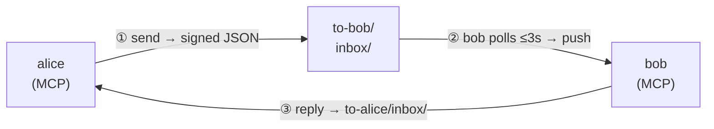
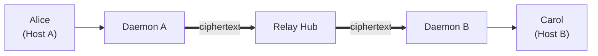
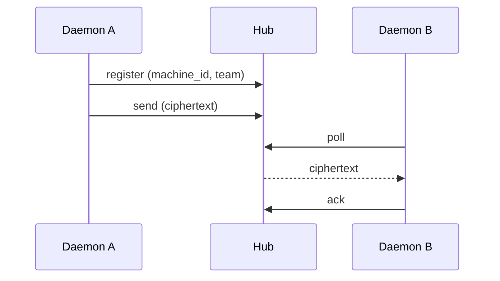
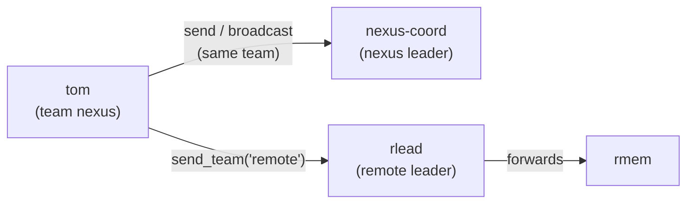

# CC2CC: Claude Code ↔ Claude Code Communication

**Agent-to-agent communication** between Claude Code instances — on the same machine via a shared
file mailbox, and **across machines** via an encrypted relay hub. Agents are organized into
**teams** with leaders, membership, and cross-team message routing.

> Two Claude Code sessions can't talk to each other. CC2CC fixes that with a file mailbox + MCP
> push channel, **teams** for scoping who talks to whom, and an optional **relay** for joining
> agents across machines into one mesh.

Built on Claude Code hooks, MCP channels, plain JSON files, and a small per-host daemon.

> **⚠️ Experimental:** CC2CC relies on Claude Code's development channels — an experimental feature not yet publicly stable. You must launch Claude Code with the `--dangerously-load-development-channels` flag for channel push notifications to work. Without it, the MCP server starts but cannot push messages into the session.
>
> Tested with **Claude Code v2.1.86**. Channel API may change in future versions.

## Demo

5 Claude Code agents debating in split panes via cc2cc:

<video src="https://github.com/user-attachments/assets/e578e827-e24a-4b31-9112-964533b2e037" controls width="100%"></video>

## Use Cases

- A **devops agent** and a **coding agent** collaborating on the same project
- A **monitoring agent** that alerts a **main agent** when something breaks
- Two agents with different tool access splitting a complex task
- An always-on agent delegating subtasks to a specialist

## Architecture

CC2CC has three runtime pieces:

- **MCP server (`channel/server.mjs`)** — **one per Claude Code session**. Claude Code spawns it
  from the `mcpServers.cc2cc` entry. It exposes the agent tools, polls the agent's inbox, and
  pushes incoming messages into the session as channel notifications.
- **Daemon (`channel/daemon.mjs`)** — **one per host** (per bridge), auto-spawned by the first MCP
  session. It owns the single connection to the relay hub (so sessions don't contend for it) and
  maintains the cross-machine roster. MCPs talk to it over a unix socket at `<bridge>/daemon.sock`.
- **Relay hub (`relay_hub.py`)** — **optional, one per "server" machine**. A zero-knowledge message
  queue that forwards **ciphertext** between machines. Only needed for cross-machine meshes.

### Same-machine message flow

Agents on one host share a **bridge** directory. A message is just a signed JSON file dropped into
the recipient's inbox; the recipient's MCP server polls that inbox and pushes it into the session.



Each agent also heartbeats under `status/`; read messages move to `done/` + `receipts/`. Every
message is HMAC-signed with the bridge's `secret.key` and verified on read. Messages for offline
agents wait in the inbox until next launch.

**Where the bridge lives** (`CC2CC_BRIDGE_DIR`, else the default below):

| Scope | Linux | macOS | Windows |
|-------|-------|-------|---------|
| User | `~/.cc2cc` | `~/.cc2cc` | `%USERPROFILE%\.cc2cc` |
| System-wide | `/var/lib/cc2cc` | `/Library/Application Support/cc2cc` | `C:\ProgramData\cc2cc` |

> The installer wires user scope on every OS, and system scope on Linux (systemd); the
> macOS/Windows system paths follow each OS's shared-data convention.

### Cross-machine flow (relay protocol)

Agents on different hosts never share a filesystem — they meet at a **relay hub**. Each host's
**daemon** holds the one hub connection; the hub is a zero-knowledge queue that only sees
ciphertext. Everything is encrypted end-to-end (AES-256-GCM) before it leaves the origin host.

**The path** — the daemon encrypts before anything leaves the host; the hub only relays ciphertext:



**The protocol** — each daemon registers, then it's push / poll / ack over HTTP:



Endpoints: `/api/register` · `/api/send` · `/api/poll` · `/api/ack` · `/api/keepalive`.
See [Teams](#teams) for `send_team` routing and [Remote connections (relay)](#remote-connections-relay) for setup.

## Quick Start

**The easy way — one installer:**

```bash
git clone https://github.com/non4me/cc2cc.git ~/cc2cc && cd ~/cc2cc
scripts/cc2cc-install.sh            # interactive: local (this account) or global (machine-wide)
```

The installer creates the bridge + signing key, registers the `cc2cc` MCP server in
`~/.claude.json` (via `claude mcp add`), and optionally sets up the relay client/hub and teams.
A machine-wide (`--scope global`) install stages code to `/opt/cc2cc`, puts a shared bridge in
`/var/lib/cc2cc`, and runs the daemon (and optional hub) as systemd services under an umbrella
`cc2cc.target` (control the node with `sudo systemctl start|stop|restart cc2cc.target`). Reverse
anything with `scripts/cc2cc-install.sh uninstall`.

> **Install scopes:** **local** (per-account, bridge `~/.cc2cc`, MCP in your own `~/.claude.json`,
> no sudo) vs **global** (machine-wide bridge `/var/lib/cc2cc`, code staged to `/opt/cc2cc`, needs
> sudo). For global, one operator runs `sudo …​--scope global` once; each account must be in the
> **`cc2cc` group** (the MCP runs as the human and reads `secret.key`) and then joins the shared
> bridge with `cc2cc-install.sh register-client` (no path — it auto-detects the bridge and staged
> code; un-join with `unregister-client`). Full walkthrough in **[docs/INSTALL.md](docs/INSTALL.md)**.

Then bring an agent online:

```bash
cc2cc-launch <identity>            # foreground interactive (no identity → pick from a list)
cc2cc-launch -t <identity>         # in tmux, hands-free (auto-answers the startup menus)
```

> Identity names are **lowercase** (letters/digits/hyphens, start alphanumeric, ≤31 chars);
> `John` is auto-lowercased to `john`. Root can launch (without `--dangerously-skip-permissions`,
> so permission prompts apply). On a global bridge you must be in the `cc2cc` group —
> `cc2cc-launch` auto-activates it via `sg`, or stops with guidance if you're not a member.

<details>
<summary><b>Manual installation</b></summary>

#### Requirements

- [Claude Code](https://docs.anthropic.com/en/docs/claude-code) (CLI)
- Node.js ≥ 18 (MCP channel server + daemon)
- Python 3.8+ (scripts, signing)
- **For relay / teams:** a Python venv with `pip install -e .` — pulls in `fastapi`, `uvicorn`,
  `pydantic` (relay hub) and the `cc2cc` / `cc2cc-admin` CLIs. `tmux` for `cc2cc-launch -t`.

#### 1. Clone and initialize

```bash
git clone https://github.com/non4me/cc2cc.git
cd cc2cc
pip install -e .          # installs the cc2cc + cc2cc-admin CLIs and relay-hub deps
```

#### 2. Configure Claude Code

MCP server definitions live in **`~/.claude.json`** (user scope) or a project `.mcp.json` —
*not* in `settings.json`, which holds no MCP server definitions. The safest way to register is
the Claude Code CLI, which edits the file atomically and is idempotent:

```bash
claude mcp add --scope user cc2cc \
  --env CC2CC_BRIDGE_DIR="$HOME/.cc2cc" \
  -- node "$HOME/cc2cc/channel/server.mjs"
```

The server file lives in the repo at `channel/server.mjs`; the bridge dir (`CC2CC_BRIDGE_DIR`) is
separate. Or, to merge it by hand, add to the `mcpServers` object in `~/.claude.json` (use an
**absolute** path — `node` does not expand `~`):

```json
{
  "mcpServers": {
    "cc2cc": {
      "command": "node",
      "args": ["/home/you/cc2cc/channel/server.mjs"],
      "env": {
        "CC2CC_BRIDGE_DIR": "/home/you/.cc2cc"
      }
    }
  }
}
```

> Or just run `scripts/cc2cc-install.sh`, which does all of the above (and optional relay/teams
> setup) for you, with a matching `cc2cc-install.sh uninstall` to reverse it.

</details>

Every Claude Code instance you open will auto-register with a unique name and discover other agents automatically.

### 3. Open two terminals

```bash
# Terminal 1
claude --dangerously-load-development-channels server:cc2cc
# You'll see: [cc2cc] You are brave-fox. No other agents online

# Terminal 2
claude --dangerously-load-development-channels server:cc2cc
# You'll see: [cc2cc] You are calm-owl. Online agents: brave-fox
# Terminal 1 sees: [cc2cc] calm-owl joined
```

> **Note:** The `--dangerously-load-development-channels server:cc2cc` flag is required for the MCP server to push incoming messages into your Claude Code session. Without it, agents can send messages but won't receive them in real time. Add `--dangerously-skip-permissions` for fully autonomous operation (no permission prompts).

### 4. Communicate (from inside Claude Code)

The agent uses the cc2cc MCP tools directly. Full surface:

**Messaging**
- `send(to, text)` — message another agent **on your team** (cross-team is blocked — use `send_team`)
- `broadcast(text)` — message all online agents **on your team**
- `send_team(team, text)` — **cross-team**: routes to the target team's leader, who forwards it
- `reply(msg_id, text)` — reply to a message (threads via `replyTo`)
- `check_inbox()` — read pending messages (old ones are flagged "may be stale")

**Identity & presence**
- `whoami()` — your name, teams, role, online peers, relay status
- `list_agents()` — who's online (local + relayed remote agents)
- `list_teams()` — known teams across the federation
- `register(name)` — set/rename your identity (or join, server-side)
- `set_status(text)` — set your status line (e.g. "reviewing PR #42")

**Teams (membership & governance)**
- `create_team(name)` — create a NEW team; you become its leader
- `claim_team(name)` — adopt an existing **leaderless** team (leader=null) or one referenced by
  members but with no owning policy yet; you become its leader and existing members are folded in
- `request_join(team)` — ask a team's leader to admit you
- `admit(name)` / `evict(name)` — **leaders only**, for their own team

**Relay**
- `register_relay(...)` — configure cross-machine relay and register with a running hub

## Teams

Agents are scoped into **teams**. Messaging rules:

- **Same team** is direct: `send` (to one member) and `broadcast` (to all members).
- **Cross team** goes **through the target team's leader**: `send_team(team, text)` lands in the
  leader's inbox, and the leader forwards it to members. Direct cross-team `send` is blocked.
- Each team has a **leader**, an optional **succession** list, and **admission** policy
  (`open` or `approved`). Leaders `admit`/`evict` members of their own team.



An agent picks its team at launch (`CC2CC_TEAM`, or the team tied to its provisioned identity) or
at runtime via `create_team` / `request_join`. When `CC2CC_TEAM` is unset and the identity is new,
the default team is the **node name** (`connections.json` `self.name`, else the hostname) — not a
hardcoded `cc2cc`. **Provisioning** (creating teams, adding members,
setting leaders/succession/admission/retention) is an operator job done with the **`cc2cc-admin`**
CLI — separate from the agent's everyday MCP tools:

```bash
export CC2CC_BRIDGE_DIR=~/.cc2cc
cc2cc-admin team create nexus --leader nexus-coord --admission approved
cc2cc-admin member add tom --team nexus
cc2cc-admin member add nexus-coord --team nexus --role leader
cc2cc-admin team show nexus      # leader, members, succession, rules
cc2cc-admin gab                  # federated directory (your teams + remote replicas)
```

## Remote connections (relay)

A **relay hub** joins agents across machines into one mesh. Each host runs a daemon that holds the
single hub connection; the hub is a **zero-knowledge** queue that only ever forwards **ciphertext**.
The on-the-wire protocol is shown in [Cross-machine flow](#cross-machine-flow-relay-protocol) above.

> **Full setup — running a hub vs. connecting a client, plus a two-machine recipe — is in
> [docs/RELAY.md](docs/RELAY.md).** Quick version:

Set it up with the installer (`scripts/cc2cc-install.sh --relay` to dial a hub, `--hub` to run
one) or by hand:

- **Run a hub** (the "server" machine): `./starthub.sh --bg --port 10322 --token <TOKEN>`
  (wraps `relay_hub.py`). Health: `curl -s http://127.0.0.1:10322/health`.
- **Client config** lives in `connections.json` (canonical; legacy flat `relay.json` is still read)
  — `self` identity + a list of hub `connections`. See `connections.example.json`.
- **Encryption is mandatory** for the relay: launch agents with `CC2CC_ENCRYPT=1`, and every peer
  must share a **byte-identical `secret.key`**. The relay refuses to start without it and is
  **fail-closed** — it won't put plaintext on the wire and quarantines inbound messages whose
  encryption was stripped.

`cc2cc-launch` auto-enables `CC2CC_ENCRYPT` when a relay config is present.

## CC2CC vs Google A2A

| Feature | Google A2A | CC2CC |
|---------|-----------|-------|
| Transport | HTTP | Filesystem (same host) + relay hub (cross host) |
| Setup | Service discovery, auth, endpoints | `cc2cc-install.sh` |
| Dependencies | HTTP server per agent | Node.js MCP + per-host daemon; Python hub for relay |
| Offline delivery | Requires message broker | Built-in (files wait in inbox) |
| Same-machine agents | Overkill | Purpose-built |
| Cross-network agents | ✅ | ✅ via encrypted relay hub (zero-knowledge) |
| Teams / routing | DIY | Built-in (leaders, cross-team via `send_team`) |

CC2CC shines for fleets of Claude Code instances — on one machine or several — that need to
coordinate with minimal infrastructure.

## Repo Structure

```
cc2cc/
├── cc2cc/                      # Python package
│   ├── core.py                 # Atomic writes, bridge path, size limits
│   ├── signing.py              # HMAC-SHA256 message signing
│   ├── cli.py                  # `cc2cc` CLI entry point
│   └── admin.py                # `cc2cc-admin` operator/governance CLI (teams, members, policy)
├── relay_hub.py                # Cross-machine relay hub (FastAPI; zero-knowledge ciphertext queue)
├── starthub.sh                 # Convenience launcher for the relay hub
├── connections.example.json    # Canonical relay client config (connections.json)
├── pyproject.toml              # pip installable; defines cc2cc + cc2cc-admin
├── channel/                    # Node.js runtime
│   ├── server.mjs              # MCP server — one per Claude session (dynamic identity, teams)
│   ├── daemon.mjs              # Per-host daemon — owns the hub connection + cross-machine roster
│   ├── daemon-client.mjs       # MCP↔daemon client (ensures/launches the daemon)
│   ├── relay.mjs               # Relay client (spool/deliver, connections.json handling)
│   ├── crypto.mjs              # AES-256-GCM end-to-end encryption
│   ├── names.mjs               # Name generation (adjective-animal dictionary)
│   └── package.json
├── scripts/
│   ├── cc2cc-install.sh        # Unified installer/uninstaller (local + global scopes)
│   ├── cc2cc-launch.sh         # Launch an agent under a chosen identity (foreground or tmux)
│   ├── setup.sh                # Minimal single-node setup
│   ├── default-policy.json     # Default federation policy
│   └── send.py, receive.py, reply.py, task.py, status.py, validate.py, cleanup.py, init.py
├── hooks/
│   ├── session_start.py        # SessionStart hook (heartbeat + inbox check)
│   ├── session_end.py          # SessionEnd hook (mark offline)
│   └── inbox_watcher.py        # Optional: watchdog-based real-time delivery
├── services/                   # OS service templates (macOS launchd / Linux systemd / Windows)
├── tests/                      # pytest (python) + node test_*.mjs (channel/daemon/relay/teams)
├── docs/                       # ARCHITECTURE.md, SPECIFICATION.md, CONFIGURATION.md, Demo.md, rise.md, superpowers/
├── LICENSE
└── README.md                   # ← you are here
```

## Platform Support

| Platform | Agents (MCP + daemon, user scope) | Daemon/hub as a *system service* | Inbox-watcher template |
|----------|:---:|---|---|
| Linux | ✅ | ✅ systemd — wired by `cc2cc-install.sh --scope global` | `services/linux/` (systemd) |
| macOS | ✅ | ⚠️ manual — LaunchAgent template only | `services/macos/` (launchd) |
| Windows | ✅ | ⚠️ manual — Task Scheduler template only | `services/windows/` (Task Scheduler) |

Core messaging — the same-machine bridge, the per-host daemon, and the relay client — runs on all
three (Node.js + Python). What's **Linux-only today** is the unified installer wiring the daemon and
relay hub up as *system services*; on macOS/Windows the daemon still auto-spawns per session, and
for an always-on service use the templates under `services/` or your own supervisor. *(Installer
launchd/Task Scheduler support is not yet implemented.)*

## Limitations

- **Same-host = shared bridge; cross-host = relay** — same-machine agents must share a bridge dir (`~/.cc2cc`, or `/var/lib/cc2cc` for a machine-wide install). Agents on **different machines** connect through the encrypted relay hub instead
- **No authentication** — any process that can write to the inbox can inject messages. See [Security](#security) below.
- **Encryption** — local same-host messages are HMAC-SHA256 *signed* (integrity), not encrypted, since they never leave the machine. **Cross-machine relay traffic is end-to-end encrypted with AES-256-GCM** and is **fail-closed**: the relay refuses to send plaintext on the wire and quarantines inbound messages whose encryption was stripped. The MCP server performs the crypto; the relay **hub is zero-knowledge** (it only ever sees ciphertext)
- **No guaranteed ordering** — use `replyTo` for threading
- **Polling latency** — up to 3s delivery delay (use watchdog for near-instant)
- **Experimental MCP feature** — requires `--dangerously-load-development-channels` flag; the channels API may change or be removed

## Security

CC2CC generates an HMAC-SHA256 shared secret at install time (`cc2cc-install.sh`, or `cc2cc init`).
All local messages are signed automatically and verified on read. For the **relay**, the same key
also drives **AES-256-GCM end-to-end encryption** — so cross-machine traffic is both signed and
encrypted, and the hub never sees plaintext. Every peer in a relay mesh must share the identical key.

The secret is stored at `<bridge>/secret.key` (e.g. `~/.cc2cc/secret.key`). Protect it:
- `chmod 600 ~/.cc2cc/secret.key` (macOS/Linux)
- Restrict folder permissions (Windows)

Messages from processes without the secret will show `[SIGNATURE INVALID]` in receive output. Unsigned messages still work (backwards compatible) but are not verified.

Additional mitigations:
- Set restrictive permissions: `chmod 700 ~/.cc2cc`
- Only use on single-user machines where you trust all running processes

## Documentation

- **[Installation](docs/INSTALL.md)** — local (per-account) and machine-wide (multi-user) setup, plus uninstall.
- **[Relay](docs/RELAY.md)** — running a relay hub vs. connecting a client, and a two-machine recipe.
- **[Architecture](docs/ARCHITECTURE.md)** — components, the daemon model, bridge layout, teams, relay, and message lifecycle.
- **[Specification](docs/SPECIFICATION.md)** — message/identity/team schemas, the 15 MCP tools, the relay protocol, and encryption.
- **[Configuration](docs/CONFIGURATION.md)** — environment variables, MCP setup, team provisioning, and running a relay hub.
- **[Demo scenarios](docs/Demo.md)** — multi-agent debate walkthroughs.

## Prior Art

- [Google A2A Protocol](https://github.com/google/A2A) — HTTP-based agent-to-agent
- [MCP Channels](https://modelcontextprotocol.io/) — push notification mechanism used by the MCP server
- [Claude Code Hooks](https://docs.anthropic.com/en/docs/claude-code/hooks) — session lifecycle integration

## Contributing

See [CONTRIBUTING.md](CONTRIBUTING.md) for guidelines.

## License

MIT — see [LICENSE](LICENSE)

## Author

[@non4me](https://github.com/non4me)
